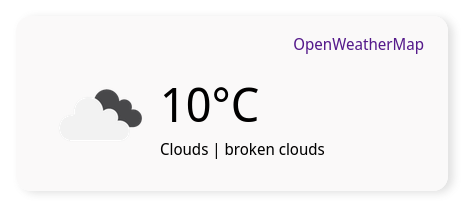
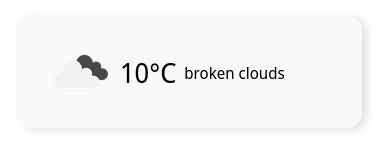

# Vue Weather Widgets

A small collection of Weather Widgets; Built with Vue.

## Usage

Supply your OpenWeather API key One call API Key, as well as all required props.

### Standard




### Standard + Daily prop


#### Props

```typescript
interface Props {
  apikey?: string
  lat: string
  lon: string
  imperial?: boolean
  daily?: boolean
  warningThresholds?: {
    min: number
    max: number
  }
  warningColour?: string
  bgColour?: string
}
```


### Medium


#### Props

```typescript
interface Props {
  apikey?: string
  lat: string
  lon: string
  imperial?: boolean
}
```

### Small



#### Props

```typescript
interface Props {
  apikey?: string
  lat: string
  lon: string
  imperial?: boolean
}
```

### Extra Small


#### Props

```typescript
interface Props {
  apikey?: string
  lat: string
  lon: string
  imperial?: boolean
}
```